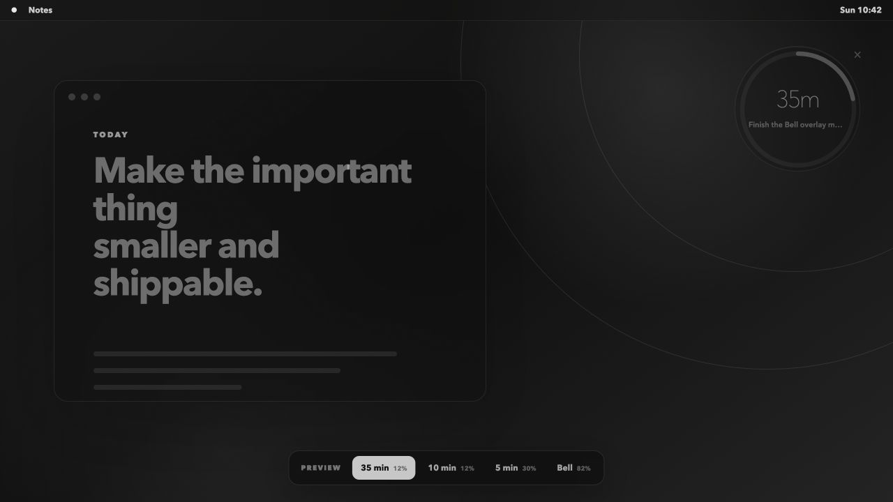
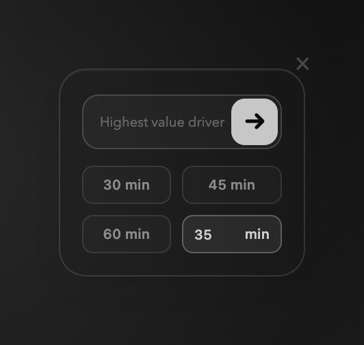

# Minimalistic Productivity Overlay

> One foreground task. Everything else can wait for a timeslice.

Bell is a least-distracting overlay timer for the age of agents. When ten things are competing for attention, it keeps one highest-value task visibly assigned to the foreground while everything else remains background work.

Think of it as a scheduler for your brain: the main task gets the CPU, side quests wait in the queue, and the fastest interrupt does not get to starve the process that actually matters. Bell stays silent and translucent in the top-right, changes only every five minutes, and asks what deserves the next block when time is up.

## Preview

Bell is the compact widget in each crop; the surrounding dark texture represents whatever is already on your desktop.

| During a focus block | Between blocks |
| --- | --- |
|  |  |

## Run

Requires macOS 14 or newer and the Swift toolchain.

```bash
./Scripts/run.sh
```

The packaged app is written to `dist/Bell.app`.

All scripts resolve paths from the repository root. No machine-specific paths or configuration are required.

If the shell alias is installed, use `bell` to launch it. Quit from the subtle `×`, the menu bar, `⌘Q`, or:

```bash
pkill -x Bell
```

## Behavior

- Configurable duration, defaulting to 35 minutes
- Time and perimeter change only at five-minute boundaries
- Very translucent until the final five minutes
- Current goal inside the round timer, without a redundant label
- Click the goal to edit it and restart the block
- The editor contains one `Highest value driver` field, an arrow, `30/45/60 min` chips, and a custom-minutes field
- Timer and editor share one fixed 210 × 196 overlay footprint, preventing edge overflow when states change
- Silent, draggable, always-on-top overlay across Spaces
- Black, gray, and white only
- Local CSV at `~/Library/Application Support/Bell/focus-log.csv`, with local-time timestamps, `completed ✓`, and clean canceled durations such as `13m`
- No accounts, analytics, network requests, or cloud storage

The exact interaction contract lives in [BEHAVIOR.md](BEHAVIOR.md).

## Keyboard shortcuts

Shortcuts work while the goal editor is visible and Bell is the active app.

| Shortcut | Action |
| --- | --- |
| `⌘0` | Focus the goal |
| `⌘1` | Select 30 minutes |
| `⌘2` | Select 45 minutes |
| `⌘3` | Select 60 minutes |
| `⌘4` | Focus custom minutes |
| `⌘↩` | Start the timer |

## Check

```bash
swift build
swiftc Sources/Bell/FocusRecord.swift Sources/Bell/FocusLog.swift Sources/Bell/TimerMath.swift Tests/BellTests/CSVCodecTests.swift -o .build/bell-tests
.build/bell-tests
```
